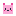
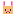
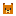
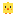
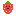
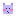

# Cutify That Tab ✨

> A Claude Code skill for adding a cute, hand-authored SVG favicon to a web app — that tiny icon in the browser tab.

[](https://github.com/wan-huiyan/cutify-that-tab/releases)
[](LICENSE)
[](https://github.com/wan-huiyan/cutify-that-tab/commits)
[](https://claude.com/claude-code)

<p align="center">
  
  
  
  
  
  
  <br/>
  
  
  
  
  
  
  <br/>
  
  
  
  
  
  
  <br/>
  
  
  
</p>

## Why this exists

Most online "favicon generators" produce a 12-file pack (`favicon.ico`, `apple-touch-icon` variants, `manifest.json`, ...) for a problem that needs **one SVG file**. Modern browsers have supported `<link rel="icon" type="image/svg+xml">` since 2020 — 96%+ global support today.

This skill gives Claude Code the recipes to author cute, hand-coded favicons in a single SVG, plus the verification loop to make sure they actually read at real tab size (~14–16px).

## Quick Start

```
You: my app's browser tab is just a blank square. can you put something cute in there?

Claude: [reads skill] I'll add an SVG favicon. Three quick questions:
  - what vibe — emoji, gradient blob mascot, or 16×16 pixel-art mascot?
  - what color palette?
  - which animal / character if pixel art (bunny, bear, ghost, mochi cat, ...)?

You: pixel-art mochi cat, pink palette

Claude: [writes static/favicon.svg, wires up <link>, opens /tmp/favicon_preview.html
        showing 16/32/64/128 px stacked, iterates with you until shipped]
```

## The three techniques

| Technique | Effort | Vibe | When to pick |
|---|---|---|---|
| **A · Emoji as favicon** | ~30 sec | 🐱 minimum-viable | "Just put SOMETHING there" — works with any emoji |
| **B · Gradient mascot blob** | ~5 min | soft, friendly, brand-ish | Marketing site, indie SaaS, "personality not pixels" |
| **C · 16×16 pixel-art sticker** | ~10 min | kawaii, retro, dev-tool charm | Internal dashboard, dev tool, "we have taste" |

All three ship as a single SVG file. No `.ico`, no PNG fallbacks, no PWA manifest, no apple-touch-icon variants — those are different problems.

## What you get

- **`<link rel="icon" type="image/svg+xml">` recipe** — the modern one-liner
- **32 starter SVGs** in `examples/` — bunny, bear, mochi cat, ghost, chick, bee, strawberry, cloud, dango, frog, sheep, monkey, plus emotion-variant gradient blobs (heart-eyes, smug, surprise, starry, kissy, hugg, woah, cheer, love rays, ...). Copy + rename + edit colors
- **Live verification loop** — `/tmp/favicon_preview.html` rendering the favicon at 16/32/64/128 px so you iterate against real tab size, not the enlarged SVG
- **Tab-edge / tab-background diagnosis** — three distinct failure modes (chrome blending, dark-mode mismatch, light-tab silhouette vanish) with decision trees for each
- **Dark-mode-aware favicons** — the two-file `<link media>` recipe that works in Chrome 92+, Firefox, and Safari (single-file CSS-in-SVG `@media` is ignored by Chrome for favicons — this is documented in the skill)

## Installation

**Claude Code (plugin install — recommended):**
```bash
/plugin marketplace add wan-huiyan/cutify-that-tab
/plugin install cutify-that-tab@wan-huiyan-cutify-that-tab
```

**Claude Code (git clone — always works):**
```bash
git clone https://github.com/wan-huiyan/cutify-that-tab.git ~/.claude/skills/cutify-that-tab
```

**Cursor:**
```bash
# Per-project rule (most reliable)
mkdir -p .cursor/rules
# Copy SKILL.md content into .cursor/rules/cutify-that-tab.mdc with alwaysApply: true

# Or global
git clone https://github.com/wan-huiyan/cutify-that-tab.git ~/.cursor/skills/cutify-that-tab
```

## Three failure modes the skill catches

The skill documents three distinct ways favicons silently break at real tab size — failures that file-level previews (`` against a flat dark `<body>`) don't expose. Each has a different fix:

| # | Failure | Looks fine in | Breaks in | Fix |
|---|---|---|---|---|
| 1 | **Tab-edge blending** | File preview against dark `<body>` | Chrome's rounded tab chrome | 14×14 inset tile, 1-cell outer margin (the "two-margin rule") |
| 2 | **Dark-mode mismatch** | Single system theme | System theme switch | Two-file `<link media="(prefers-color-scheme: dark)">` recipe |
| 3 | **Light-tab silhouette vanish** | Dark mocks + dark-mode tabs | Light-mode inactive tab (Chrome's grey-sage `#c2c5be`) | Tint body to Tailwind `*-300` tier, or add tile, or add outline |

Failure #3 is the subtle one: `prefers-color-scheme` does NOT fix it — Chrome is technically in light mode while showing the grey-sage inactive tab, so the light-mode variant fires, which is the white body that disappears.

## Examples directory

The 32 starter SVGs in `examples/` — each is 13–25 lines, hand-authorable, copy-and-edit:

### Pixel-art mascots (Technique C)

| Preview | File | Vibe |
|---|---|---|
|  | `pixel_mochi_cat.svg` | classic pink mochi cat, transparent bg |
|  | `pixel_bunny.svg` | peach bunny with pink ears |
|  | `pixel_bear.svg` | brown bear with cream snout |
|  | `pixel_chick.svg` | yellow chick with orange beak + feet |
|  | `pixel_bee.svg` | striped bee with sky-blue wings |
|  | `pixel_strawberry.svg` | red strawberry with seeds and a little face |
|  | `pixel_cloud.svg` | sky-blue cloud with pink blush |
|  | `pixel_ghost.svg` | friendly ghost, transparent bg |
|  | `pixel_ghost_tile.svg` | C-variant 1 — ghost on dark rounded tile (14×14 inset) |
|  | `pixel_ghost_silhouette.svg` | C-variant 2 — GitHub-octocat-style silhouette with cut-out eyes |
|  | `pixel_ghost_silhouette_dark.svg` | the dark-mode pair for the above |
|  | `pixel_dango.svg` | dango skewer (three pastel mochi balls) |
|  | `pixel_frog.svg` | green frog face |
|  | `pixel_sheep.svg` | fluffy sheep with grey face + black legs |
|  | `pixel_cat_meow.svg` | orange cat, closed happy eyes + open meow mouth |
|  | `pixel_cat_love.svg` | grey cat with a floating pink heart above |
|  | `pixel_shy_cat.svg` | lavender cat with big blush + averted eyes |
|  | `pixel_hyper_cat.svg` | white cat with sparkly eyes + yellow motion dashes |
|  | `pixel_monkey.svg` | brown monkey with big pleading wet eyes |

### Gradient blobs — 13 emotions (Technique B)

| Preview | File | Gradient | Emotion |
|---|---|---|---|
|  | `blob_brand_grad.svg` | sunset (orange → red → pink → indigo) | 😊 happy |
|  | `blob_mint.svg` | mint → cyan | 😉 wink |
|  | `blob_heart_eyes.svg` | pink → magenta | 😍 in love |
|  | `blob_smug.svg` | lavender → violet | 😏 smug / smirk |
|  | `blob_surprise.svg` | cyan → teal | 😮 gasping (O mouth) |
|  | `blob_starry.svg` | yellow → orange | 🤩 amazed / starry-eyed |
|  | `blob_kissy.svg` | coral → pink | 😘 kissy (wink + puckered lips + blush) |
|  | `blob_wide_eye.svg` | radial amber | 🥺 anime / big-eyed |
|  | `blob_sleepy.svg` | violet → indigo | 😌 sleepy (closed arcs) |
|  | `blob_hugg.svg` | amber → orange | 🤗 hugging (crossed arms + blush) |
|  | `blob_woah.svg` | lavender → violet | 😲 surprised (raised brows + O mouth) |
|  | `blob_cheer.svg` | yellow → amber | 🙌 cheering (arms-up Y + sparkles) |
|  | `blob_love_rays.svg` | n/a (radiating heart, no face) | ❤️ radiating love |

## Limitations

- **Not a corporate brand mark.** This skill is for hand-authored, cute, low-effort favicons. If you need a polished brand mark, photographic logo, or an apple-touch-icon multi-platform pack, hand off to a designer.
- **SVG-only.** No `.ico` fallback in the recipes. Every browser shipped since 2020 supports SVG favicons (Chrome 80+, Firefox 41+, Safari 12+, Edge 80+). IE 11 and ancient Android browsers are not in scope.
- **Animation is shaky.** Most browsers reject SMIL animation in favicons; CSS animation works in some contexts but isn't covered in the canonical recipes.
- **PWA / home-screen icons.** Different problem — `manifest.json` and `apple-touch-icon` are out of scope.

## Dependencies

None at runtime — the output is a single SVG file. The skill assumes the user's web app has a `<head>` element where `<link rel="icon">` can be added; that's it.

## Key design decisions

1. **One SVG, not a 12-file pack.** The skill explicitly rejects the favicon-generator pattern of `.ico` + 4× PNG sizes + manifest + apple-touch-icon. Modern browsers don't need any of that.
2. **Live tab-size verification is non-optional.** Pixel-art choices that look great at the SVG's natural viewBox size (16×16, viewed at 200% in your editor) routinely break at the actual 14–16px tab size. The skill defaults to the `/tmp/favicon_preview.html` iterate-with-preview loop.
3. **Dark-mode goes through two files, not CSS-in-SVG.** Chrome treats favicon SVGs as image-type resources and does NOT evaluate `@media (prefers-color-scheme: dark)` inside them. The two-file `<link media>` recipe is the only cross-browser path.

## See also

- **`frontend-design`** — broader frontend / UI design guidance for Claude Code
- **`claude-design-handoff-bundle`** — for implementing a designer's specific favicon mark (different problem: rendering a brand mark, not authoring a cute one from scratch)

## References

- [MDN: SVG favicons](https://developer.mozilla.org/en-US/docs/Web/HTML/Reference/Elements/link)
- [Can I Use: SVG favicons](https://caniuse.com/link-icon-svg) — 96%+ global support as of 2026
- [`shape-rendering="crispEdges"`](https://developer.mozilla.org/en-US/docs/Web/SVG/Reference/Attribute/shape-rendering) — the magic attribute that keeps pixel art pixel-crisp

## Version history

- **v1.9.0** (2026-05-28) — Added 10 new starter mascots (6 pixel + 4 blob) inspired by a Slack emoji wishlist. Pixel: `sheep`, `cat_meow`, `cat_love`, `shy_cat`, `hyper_cat`, `monkey`. Blob: `hugg`, `woah`, `cheer`, `love_rays` (no-face radiating heart). IP-protected source emojis were skipped — all designs are original.
- **v1.8.0** (2026-05-27) — Expanded Technique B emotion vocabulary: swapped `blob_mint` to a wink and added 5 new emotion blobs (heart-eyes, smug, surprise, starry, kissy). Gradient blobs now cover 9 distinct emotions, useful for mood-picker UIs.
- **v1.7.0** (2026-05-27) — Dropped Technique D (text sticker); added 6 new pixel-art mascots (bunny, bear, chick, bee, strawberry, cloud) so the skill ships with 13 ready-to-edit pixel-art mascots and 4 gradient blobs.
- **v1.6.0** (2026-05-27) — Tightened R1 contrast guidance: tint body color should be ≥30 lightness points below the brightest tab background it must survive (Tailwind `*-300` for cream/white active tabs); `*-50` pastels vanish on cream tabs.
- **v1.5.0** (2026-05-27) — Flipped the dark-mode recipe to two files + `<link media>` after empirical finding that Chrome does NOT evaluate CSS-in-SVG `@media (prefers-color-scheme: dark)` for favicons. Browser-support matrix added.
- **v1.4.0** (2026-05-27) — Added the "silhouette disappeared into the tab background" diagnosis (distinct from tab-edge blending and dark-mode mismatch); 4-path recolor decision tree.
- **v1.3.0** (2026-05-27) — C-variant 2 (single-color silhouette with cut-out eyes, GitHub-octocat style); first dark-mode adaptation pass.
- **v1.2.0** (2026-05-27) — The "two-margin rule" for tiled pixel art (14×14 inset tile + 12-wide mascot body); live-browser verification is mandatory for tiled stickers.
- **v1.1.0** (2026-05-27) — C-variant for pixel art on a rounded tile; iterate-with-preview promoted to a first-class authoring pattern.
- **v1.0.0** (2026-05-27) — Initial skill: emoji, gradient blob, 16×16 pixel art.

## License

MIT — see [LICENSE](LICENSE).
